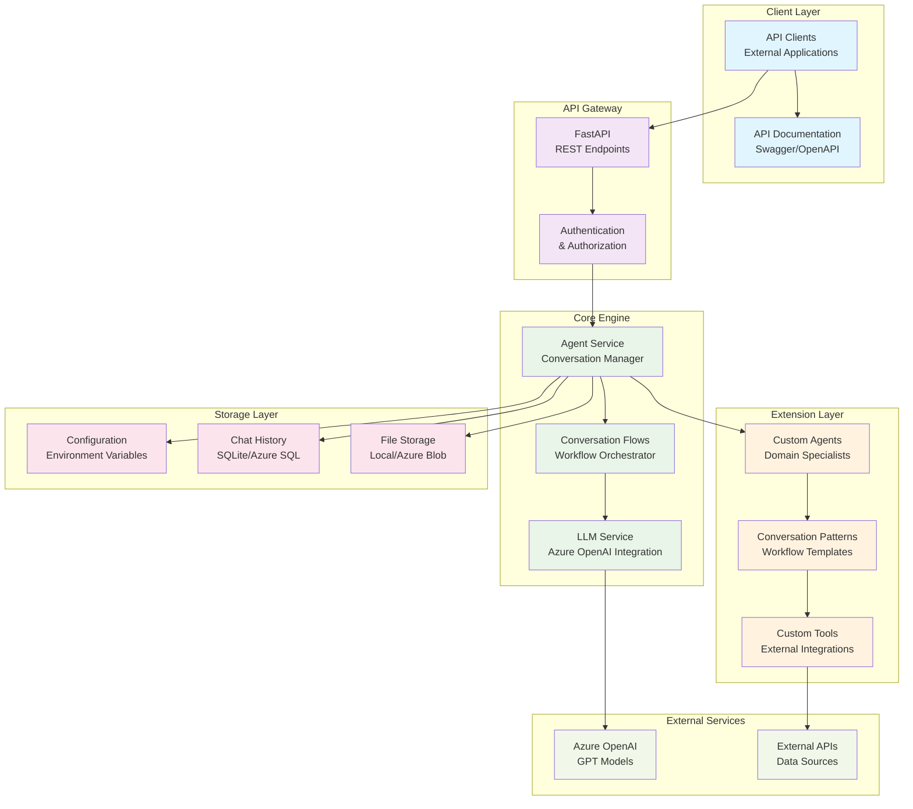
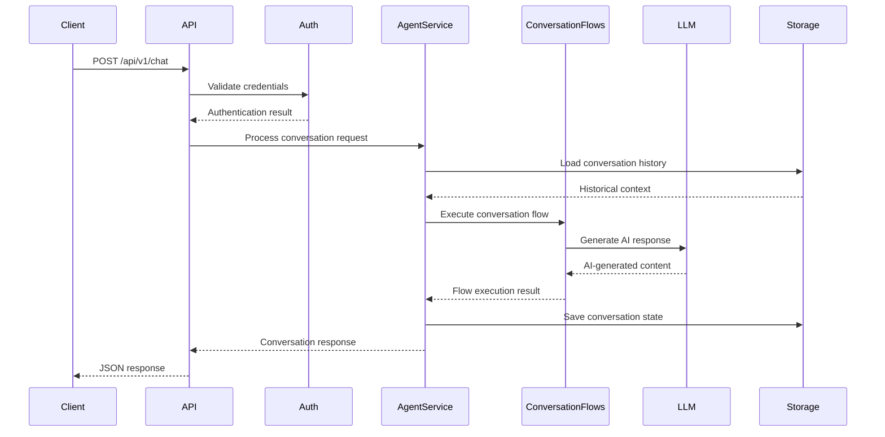
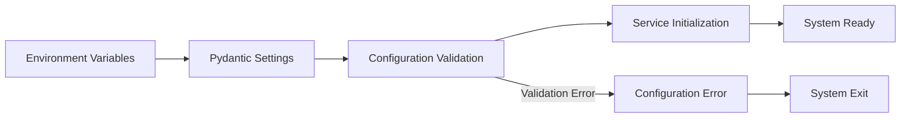
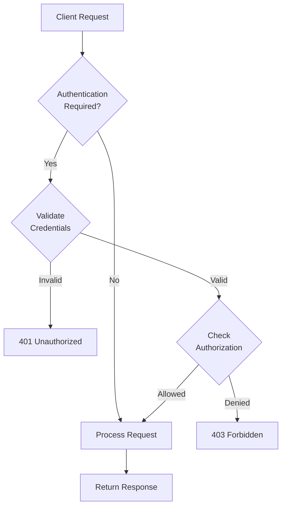
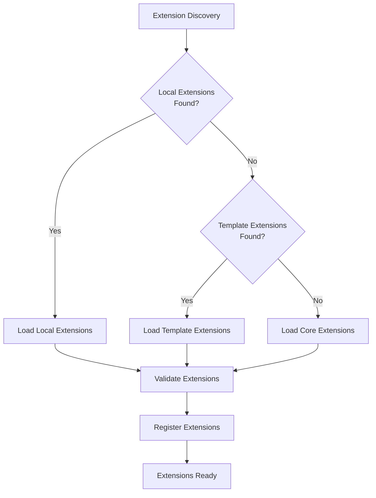
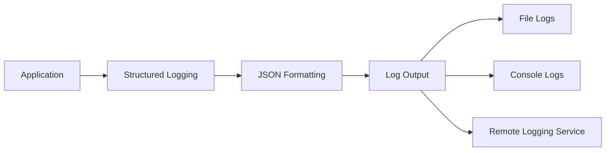
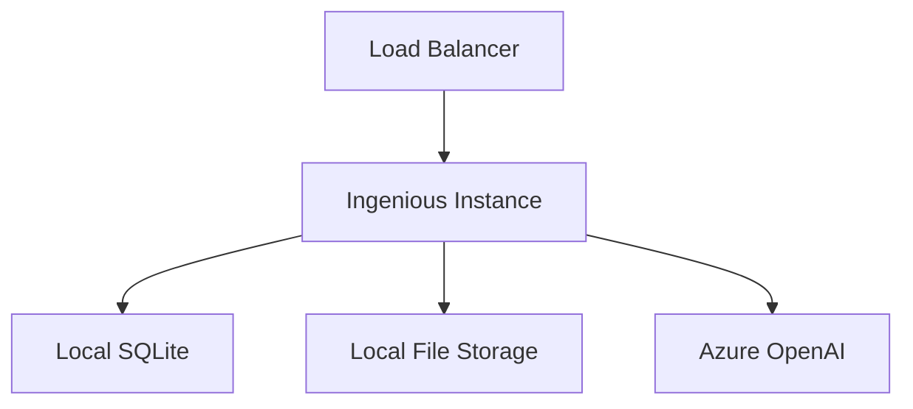
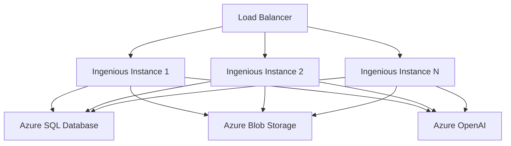

# Architecture Overview

This document describes the high-level architecture of Insight Ingenious, an enterprise-grade Python library designed for quickly setting up APIs to interact with AI Agents with comprehensive Azure service integrations and debugging capabilities.

## System Architecture

Insight Ingenious is architected as a production-ready library with enterprise-grade features including seamless Azure service integrations, robust debugging tools, and extensive customization capabilities. The system consists of the following main components:

## Core Components

### API Layer

**FastAPI Application**
- RESTful API endpoints for chat interactions
- OpenAPI/Swagger documentation
- Request/response validation with Pydantic models
- Error handling and standardized responses

**Authentication & Authorization**
- JWT token-based authentication
- Basic authentication support
- Role-based access control
- Secure credential management

### Core Engine

**Agent Service**
- Conversation management and routing
- Agent lifecycle management
- Context preservation across conversations
- Thread-safe execution

**Conversation Flows Service**
- Conversation flow orchestration
- Multi-agent coordination
- Workflow execution engine
- State management

**LLM Service**
- Azure OpenAI integration
- Model configuration and management
- Token usage tracking
- Response streaming support

### Extension Layer

**Custom Agents**
- Domain-specific AI agents
- Specialized task handlers
- Configurable behavior patterns
- Integration with external tools

**Conversation Patterns**
- Reusable workflow templates
- Multi-agent coordination patterns
- Sequential and parallel execution modes
- Error handling and retry logic

**Custom Tools**
- External API integrations
- Data source connectors
- Business logic plugins
- Utility functions

### Storage Layer

**Configuration Management**
- Environment-based configuration
- Pydantic settings validation
- Dynamic reconfiguration support
- Secure credential storage

**Chat History**
- Conversation persistence
- Multiple storage backends (SQLite, Azure SQL)
- Query and retrieval capabilities
- Data retention policies

**File Storage**
- Local and Azure Blob storage
- Version control for templates
- Binary file handling
- Secure access management

## Data Flow

### Request Processing Flow

### Configuration Loading

## Security Architecture

### Authentication Flow

### Security Features

- **Credential Management**: Environment-based secrets management
- **Input Validation**: Pydantic model validation for all inputs
- **Rate Limiting**: Request throttling and abuse prevention
- **Audit Logging**: Comprehensive request and response logging
- **Error Handling**: Secure error responses without information leakage

## Scalability Considerations

### Horizontal Scaling

- **Stateless Design**: Request processing without server-side state
- **Database Connection Pooling**: Efficient database resource management
- **Async Processing**: Non-blocking I/O for high throughput
- **Load Balancing**: Multiple instance deployment support

### Performance Optimization

- **Caching**: Response caching and template caching
- **Connection Reuse**: HTTP client connection pooling
- **Lazy Loading**: On-demand resource initialization
- **Memory Management**: Efficient resource cleanup and garbage collection

## Extension Architecture

### Extension Discovery

### Extension Interface

Extensions implement the standardized interface:

- **IConversationFlow**: Conversation workflow interface (defined in `ingenious/services/chat_services/multi_agent/service.py`)
  - Required method: `get_conversation_response()`
  - Auto-discovered by name match with `conversation_flow` parameter
  - Can leverage agents, tools, and storage backends as needed

## Monitoring and Observability

### Logging Architecture

### Metrics and Monitoring

- **Request Metrics**: Response times, error rates, throughput
- **Resource Metrics**: Memory usage, CPU utilization, database connections
- **Business Metrics**: Conversation counts, token usage, agent performance
- **Health Checks**: System health and dependency status

## Deployment Architecture

### Single Instance Deployment

### Distributed Deployment

This architecture provides a solid foundation for building scalable, secure, and maintainable AI agent APIs with comprehensive Azure integrations.
