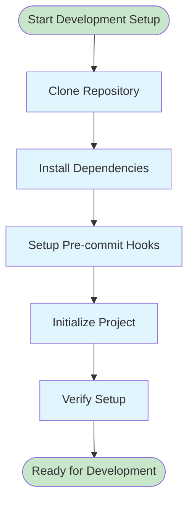

# Development Guide

This guide provides detailed information for developers who want to extend, modify, or contribute to Insight Ingenious - an enterprise-grade Python library for building AI agent APIs with Microsoft Azure integrations. The library's architecture supports extensive customization and debugging capabilities for enterprise development teams.

## Development Environment Setup

### Prerequisites

- Python 3.13 or higher
- Git
- [uv](https://docs.astral.sh/uv/) for Python package management

### Setting Up for Development



1. **Clone the repository:**

   ```bash
   git clone https://github.com/Insight-Services-APAC/ingenious.git
   cd ingenious
   ```

2. **Install dependencies and set up development environment:**

   ```bash
   uv sync --group dev
   ```

3. **Set up pre-commit hooks:**

   ```bash
   uv run pre-commit install
   ```

4. **Initialize a test project:**

   ```bash
   uv run ingen init
   ```

5. **Verify the setup:**

   ```bash
   # Run tests
   uv run pytest

   # Type checking
   uv run mypy .

   # Linting
   uv run pre-commit run --all-files
   ```

## Project Structure

```
ingenious/
├── ingenious/                  # Main library code
│   ├── client/                 # Azure client integrations
│   ├── core/                   # Core framework components
│   ├── db/                     # Database and storage
│   ├── models/                 # Data models and schemas
│   ├── services/               # Business logic services
│   │   └── chat_services/      # Chat and agent services
│   │       └── multi_agent/    # Multi-agent conversation flows
│   ├── templates/              # Jinja2 prompt templates
│   └── utils/                  # Utility functions
├── tests/                      # Test suite
├── scripts/                    # Development and deployment scripts
├── docs/                       # Documentation source
└── pyproject.toml              # Project configuration
```

## Development Workflow

### Code Quality Tools

The project uses several tools to maintain code quality:

- **Ruff**: Fast Python linter and formatter
- **MyPy**: Static type checking
- **Pytest**: Testing framework with async support
- **Pre-commit**: Git hooks for automated checks

### Running Tests

```bash
# Run all tests
uv run pytest

# Run with coverage
uv run pytest --cov=ingenious

# Run specific test file
uv run pytest tests/unit/test_specific.py

# Run specific test method
uv run pytest tests/unit/test_specific.py::TestClass::test_method
```

### Type Checking

```bash
# Type check the entire codebase
uv run mypy .

# Type check specific module
uv run mypy ingenious/services/
```

### Linting and Formatting

```bash
# Run all pre-commit hooks
uv run pre-commit run --all-files

# Run ruff linting
uv run ruff check .

# Run ruff formatting
uv run ruff format .
```

## Configuration Management

### Environment Variables

Ingenious uses environment variables with the `INGENIOUS_` prefix for configuration:

```bash
# Model configuration
INGENIOUS_MODELS__0__MODEL="gpt-4"
INGENIOUS_MODELS__0__API_KEY="your-api-key"
INGENIOUS_MODELS__0__BASE_URL="https://your-endpoint"

# Service configuration
INGENIOUS_CHAT_SERVICE__TYPE="multi_agent"
INGENIOUS_WEB_CONFIGURATION__PORT="8000"
```

### Configuration Schema

All configuration is validated using Pydantic models in `ingenious/models/configuration.py`.

## Extending Ingenious

### Creating Custom Conversation Flows

1. **Create a new flow module:**

   ```python
   # ingenious_extensions/services/chat_services/multi_agent/conversation_flows/my_flow/my_flow.py

   from ingenious.services.chat_services.multi_agent.service import IConversationFlow
   from ingenious.models.chat import ChatRequest, ChatResponse

   class ConversationFlow(IConversationFlow):
       async def get_conversation_response(self, chat_request: ChatRequest) -> ChatResponse:
           # Implement your conversation logic
           result = f"Processing: {chat_request.user_prompt}"

           return ChatResponse(
               thread_id=chat_request.thread_id,
               message_id="generated-id",
               agent_response=result,
               token_count=0,
               max_token_count=0,
               memory_summary=f"Processed: {chat_request.user_prompt[:50]}..."
           )
   ```

   **Important Notes:**
   - The class **must** be named `ConversationFlow` (not `MyFlow` or any other name)
   - Use the correct import path: `from ingenious.services.chat_services.multi_agent.service import IConversationFlow`
   - The method signature should match: `async def get_conversation_response(self, chat_request: ChatRequest) -> ChatResponse`

2. **Set up Python module discovery:**

   ```bash
   # Critical step: Set PYTHONPATH to include your project directory
   export PYTHONPATH=/path/to/your/project:$PYTHONPATH

   # Or add it to your .env file:
   echo "export PYTHONPATH=$(pwd):$PYTHONPATH" >> ~/.bashrc
   ```

3. **Add prompt templates (optional):**

   ```jinja2
   <!-- templates/prompts/my_agent_prompt.jinja -->
   You are a helpful assistant specialized in {{ domain }}.

   User query: {{ user_prompt }}
   ```

4. **Register and test the flow:**

   The flow is automatically discovered based on the directory name matching the `conversation_flow` parameter.

   ```bash
   # Restart the server to discover new workflows
   # Kill existing server first, then:
   export PYTHONPATH=/path/to/your/project:$PYTHONPATH
   KB_POLICY=local_only uv run ingen serve --port 8000
   ```

### Testing Custom Extensions

```bash
# Test your custom flow
curl -X POST http://localhost:8000/api/v1/chat \
  -H "Content-Type: application/json" \
  -d '{
    "user_prompt": "Test message",
    "conversation_flow": "my_flow"
  }'
```

### Troubleshooting Custom Workflows

**Common Issues:**

1. **Import Error**: If you see `Failed to import module`, check:
   - Import path is `from ingenious.services.chat_services.multi_agent.service import IConversationFlow`
   - Class name is exactly `ConversationFlow`
   - PYTHONPATH includes your project directory

2. **Module Not Found**: If workflow isn't discovered:
   - Restart the server after creating new workflows
   - Verify PYTHONPATH is set correctly
   - Check directory structure matches: `ingenious_extensions/services/chat_services/multi_agent/conversation_flows/your_flow_name/your_flow_name.py`

3. **Server doesn't restart**: The server must be restarted to discover new workflows

## Database Development

### Supported Databases

- **SQLite**: Default for development and testing
- **Azure SQL**: Production deployments
- **Cosmos DB**: Document storage (experimental)

### Migration Scripts

```bash
# Run database migrations
uv run python scripts/migrate_database.py

# Create new migration
uv run python scripts/create_migration.py --name "add_new_table"
```

## API Development

### Adding New Endpoints

1. **Create endpoint in appropriate module:**

   ```python
   # ingenious/api/v1/my_endpoints.py

   from fastapi import APIRouter

   router = APIRouter(prefix="/api/v1/my-feature", tags=["my-feature"])

   @router.get("/status")
   async def get_status():
       return {"status": "active"}
   ```

2. **Register in main application:**

   ```python
   # ingenious/main/app_factory.py

   from ingenious.api.v1.my_endpoints import router as my_router

   app.include_router(my_router)
   ```

### API Documentation

The API documentation is automatically generated using FastAPI's OpenAPI integration. Access it at:

- Swagger UI: `http://localhost:8000/docs`
- ReDoc: `http://localhost:8000/redoc`
- OpenAPI JSON: `http://localhost:8000/openapi.json`

## Azure Service Integration

### Adding New Azure Services

1. **Create service client:**

   ```python
   # ingenious/client/azure/my_service_client.py

   from azure.core.credentials import AzureKeyCredential
   from ingenious.client.azure.base_azure_client import BaseAzureClient

   class MyServiceClient(BaseAzureClient):
       def __init__(self, endpoint: str, credential: AzureKeyCredential):
           super().__init__(endpoint, credential)
           # Initialize your service client
   ```

2. **Add configuration:**

   ```python
   # ingenious/models/configuration.py

   class MyServiceConfig(BaseModel):
       endpoint: str
       api_key: str
       # Additional configuration fields
   ```

3. **Register in dependency injection:**

   ```python
   # ingenious/services/container.py

   container.provide("my_service", MyServiceClient,
                    endpoint=config.my_service.endpoint,
                    credential=AzureKeyCredential(config.my_service.api_key))
   ```

## Debugging and Troubleshooting

### Logging Configuration

```bash
# Enable debug logging
INGENIOUS_LOG_LEVEL=DEBUG uv run ingen serve

# Enable Azure SDK logging
AZURE_LOG_LEVEL=DEBUG uv run ingen serve
```

### Common Issues

1. **Port conflicts**: Change `INGENIOUS_WEB_CONFIGURATION__PORT`
2. **Azure authentication**: Verify service principal credentials
3. **Database connections**: Check connection strings and network access
4. **Token limits**: Monitor usage with built-in tracking

### Debug Tools

```python
# Enable detailed request logging
import logging
logging.getLogger("ingenious.services").setLevel(logging.DEBUG)

# Profile performance
import cProfile
cProfile.run('your_function()', 'profile_output.prof')
```

## Contributing

### Pull Request Process

1. **Create feature branch:**

   ```bash
   git checkout -b feature/my-new-feature
   ```

2. **Make changes and test:**

   ```bash
   uv run pytest
   uv run mypy .
   uv run pre-commit run --all-files
   ```

3. **Commit with conventional format:**

   ```bash
   git commit -m "feat: add new conversation flow pattern"
   ```

4. **Push and create PR:**

   ```bash
   git push origin feature/my-new-feature
   # Create pull request on GitHub
   ```

### Code Style Guidelines

- Follow PEP 8 with 88-character line length
- Use type hints for all function signatures
- Document public APIs with docstrings
- Write tests for new functionality
- Keep functions focused and modular

### Documentation

- Update relevant documentation files
- Include code examples for new features
- Add docstrings for public APIs
- Update configuration examples if needed

## Release Process

### Version Management

Versions follow semantic versioning (SemVer):

```bash
# Major version (breaking changes)
0.1.0 -> 1.0.0

# Minor version (new features)
1.0.0 -> 1.1.0

# Patch version (bug fixes)
1.1.0 -> 1.1.1
```

### Release Checklist

1. Update version in `pyproject.toml`
2. Update `CHANGELOG.md`
3. Run full test suite
4. Build and test package
5. Tag release and push
6. Publish to PyPI

```bash
# Build package
uv build

# Test package installation
pip install dist/ingenious-*.whl

# Tag and push release
git tag v1.0.0
git push origin v1.0.0

# Publish to PyPI
uv publish
```

## Need Help?

- Check existing issues on GitHub
- Review the architecture documentation
- Look at existing code examples
- Ask questions in discussions or issues
